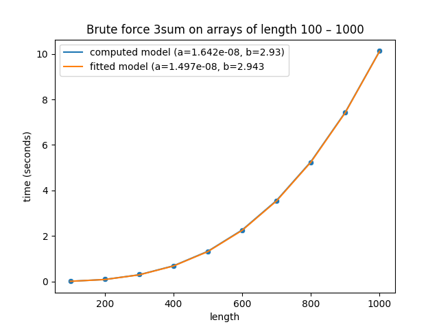
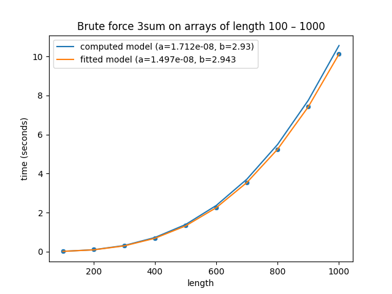
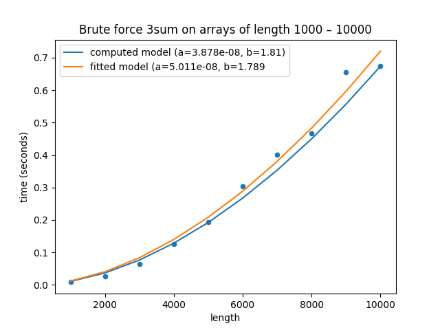
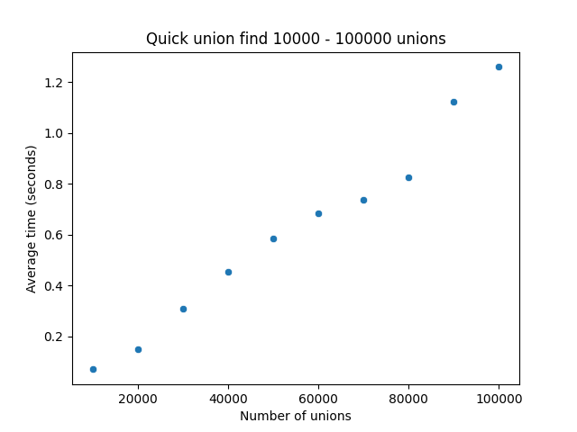
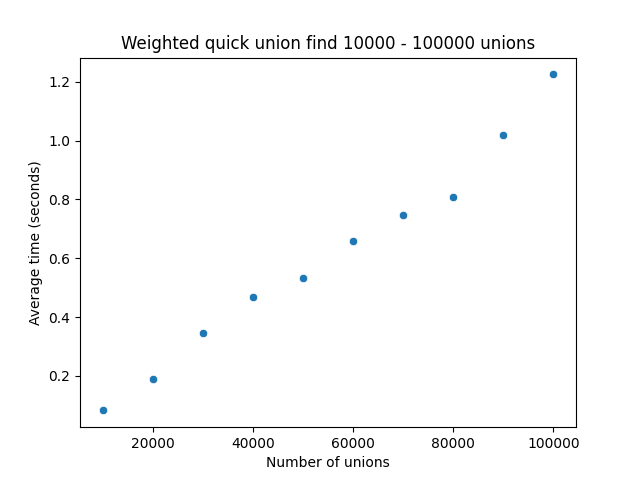

Analysis of some algorithms including 3sum, quick union find.

In App.java just uncomment the code for which task to run.
Measurements are printed to the terminal. Thease are the values i've used in my csv files.

# Uppgift 4

As the "brute-force" version of 3sum runs in cubic time O(N^3) we are expected to see a rapid growth in execution time. 

Sample data:\
500	1.3299991288\
600	2.241459219\
700	3.5401988202\
800	5.227769617\
900	7.4148761596\
1000 10.12660238

 

## Validating the times
We can validate our execution times by calculating the growth(500, 1000):\
1.32 * 8 ~ 10.56\
Which is close enough and it shows us that the execution times grows in a cubic manner.
  

## Computing the slope
We can start by computing the slope to see if our execution times match our expectations:

log2 10.12 - log2 1.32 / log2 1000 - log2 500

= 

3.339 - 0.4005 / 9.966 - 8.966

b = 2,9385 / 1 = 2.93

log2 10.12 - 2.93 * log2 1000

c = 3.339 - 2.93 * 9.966 = -25,86
  

  
The curves completely covers each other and to show that this is case i modified the constant value sligthly(-25.86 -> -25.8) in this graph:
  

  

## Slope
We can also observe that the slope (b = 2.93) is near 3 so the brute force method is cubic.

  
## 3sum Pointer Solution
By implementing the pointer solution of 3sum we can get the time complexity down to almost quadratic 
O(N^2). We can observe that it's much faster compared to 3sum brute force.
  

Calculations:\
5000	0.1932350189\
6000	0.3038539001\
7000	0.4016718017\
8000	0.4658095774\
9000	0.6564205394\
10000	0.6753639862

## Validating the times
Calculating the growth(5000, 10000):\
0.19 * 4 ~ 0.76
Just like before but the execution time grows in(near) a quadratic manner.

## Computing the slope

log2 0.67 - log2 0.19 / log2 10000 - log2 5000

= -0.5778 - -2.396 / 13.288 - 12.288

b = 1,81

log2 -0.5778 - 1,81 * log2 13.288

c = -24.62

## Slope
We can also observe that the slope (b = 1.81) is near 2 so the pointer method is near quadratic.

## Uppgift 7

  
We can observe that between 90000 - 10000 we see a quick increase in time due to the increased distance to the root.
  

 \

By implementing the weighted union find algorithm we can have broader trees instead of deeper.
This decreses the distance to the root and we can observe that we no longer see the quick increase in execution time.

